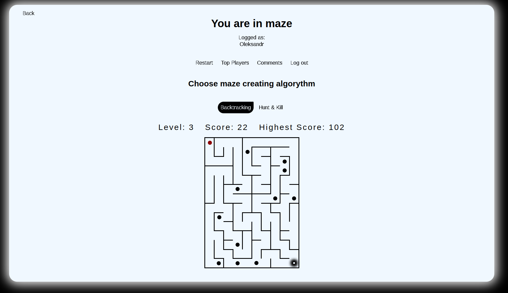
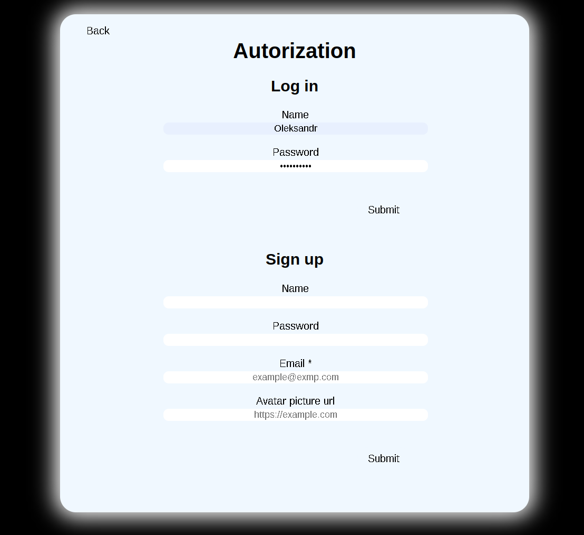
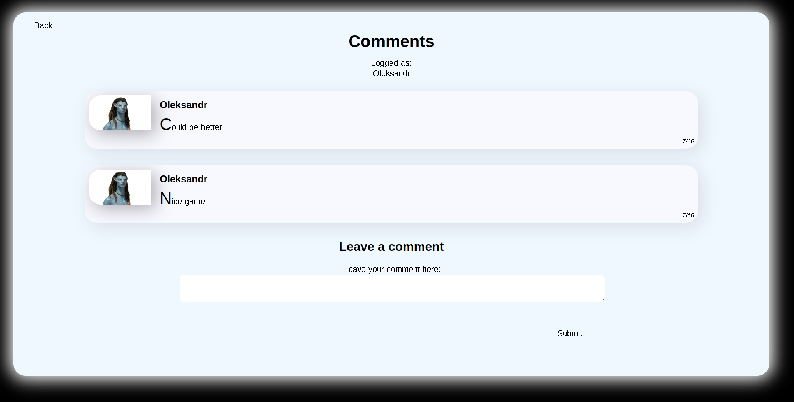
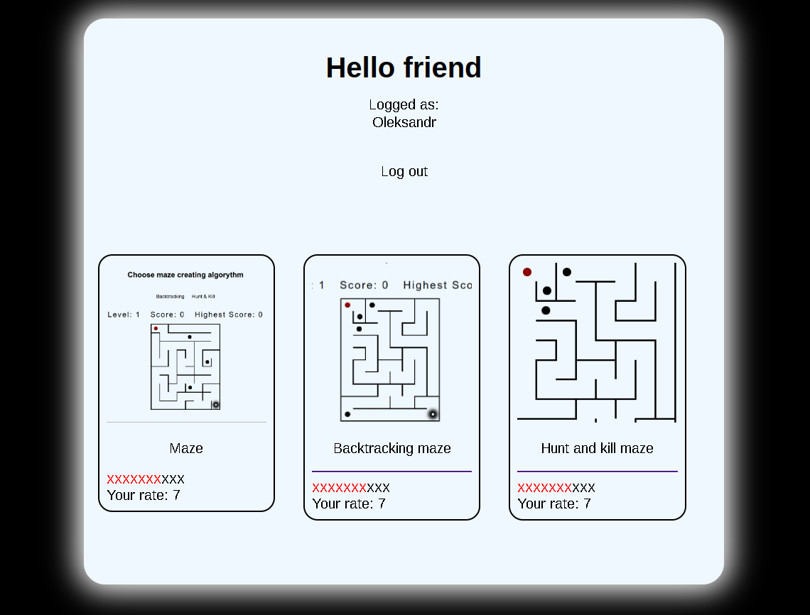

# Maze

### Overview
BA-Maze is a project designed to generate and solve mazes using various algorithms. It provides a graphical user interface (GUI) to visualize the maze generation and solving processes, making it an excellent educational tool for understanding these algorithms.

    
    
    
    

### Features

- **Maze Generation Algorithms:** Implements several algorithms for generating mazes, such as:
  - Backtracking 
  - Hunt&Kill

- Ability to create any other maze creating algorithms by implementing CoridorBuilder class

- **Interactive GUI:** A user-friendly graphical interface to:
    - Visualize the maze generation and solving process.
    - Allow users to create custom mazes.
    - Step through the algorithms to understand their working

### How to run
In order to build and run the project there should be java of version 15 or higher available on your PC and a PostgreSQL server with name: `gameJava`, user: `postgres`, password: `postgres`

There are two environments, one is console and the second one is web.
- To run console game you should run `src/main/java/Main.java`
- To run web game you should start a tomcat server `src/main/java/server/Server.java`
